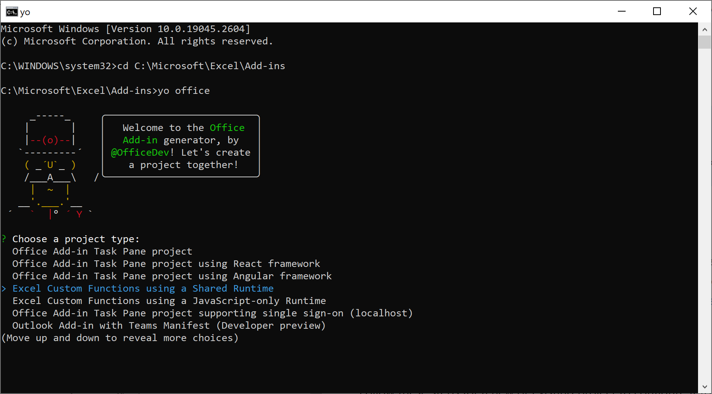
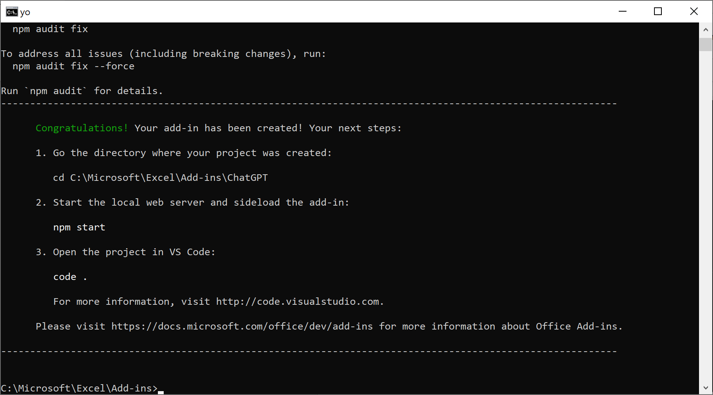
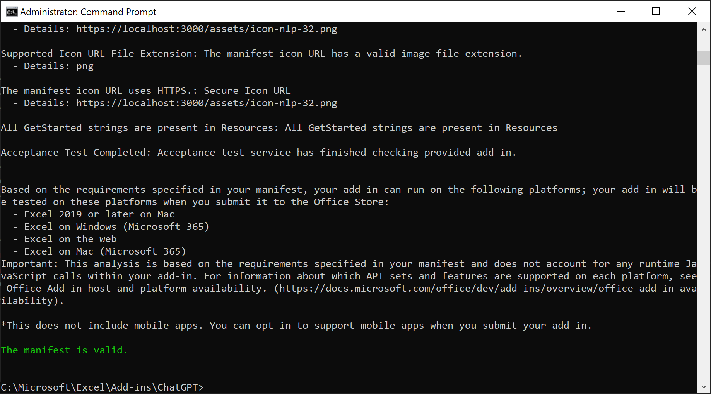

# Sentiment Analysis in Excel using ChatGPT
Discover awesome ChatGPT features you can use in Excel
<br /><br />

<!-- badges: start -->
&nbsp;&nbsp;
[](https://nodejs.org/en/)&nbsp;&nbsp;
&nbsp;&nbsp;
&nbsp;&nbsp;
[](https://github.com/analyticsinmotion/chatgpt-sentiment-analysis-in-excel/blob/main/LICENSE.md)&nbsp;&nbsp;
&nbsp;&nbsp;
&nbsp;&nbsp;
[](https://github.com/analyticsinmotion/chatgpt-sentiment-analysis-in-excel/actions/workflows/webpack.yml)&nbsp;&nbsp;
[](https://github.com/analyticsinmotion/chatgpt-sentiment-analysis-in-excel/actions/workflows/codeql.yml)&nbsp;&nbsp;
&nbsp;&nbsp;
&nbsp;&nbsp;
[](https://www.analyticsinmotion.com)&nbsp;&nbsp;
<!-- badges: end -->

<!-- DESCRIPTION -->
## 1. Description

With an Excel Custom Function Add-in you can make direct calls to ChatGPT for NLP capabilities such as text Moderation and Sentiment Analysis. Results from ChatGPT will be returned to your worksheet almost instantly.
<br /><br />


https://user-images.githubusercontent.com/52817125/221394461-92dd3f83-5d41-4f32-9f48-3d701f523b2e.mp4


<br />

<!-- GETTING STARTED -->
## 2. Getting Started
### 2.1 Dependencies
- Requires an OpenAI API Key (create an account and get API Key at <a href="https://chat.openai.com">https://chat.openai.com</a>)
- Requires Microsoft Excel (<a href="https://www.microsoft.com/en-us">https://www.microsoft.com/en-us</a>)
- Requires Node.js (>= 18.14.2 LTS) (<a href="https://nodejs.org/en/">https://nodejs.org/en/</a>)
- Requires NPM (>= 9.5.0) (<a href="https://www.npmjs.com">https://www.npmjs.com</a>)
- Requires dotenv-webpack (<a href="https://www.npmjs.com/package/dotenv-webpack">https://www.npmjs.com/package/dotenv-webpack</a>)
- Requires Yo Office generator (<a href="https://github.com/OfficeDev/generator-office">https://github.com/OfficeDev/generator-office</a>)

Please be aware of the [costs](https://openai.com/pricing) associated with using the OpenAI API when utilizing this project.

### 2.2 Editing, Debugging and Testing
- Visual Studio Code (<a href="https://code.visualstudio.com/">https://code.visualstudio.com/</a>)
  - NPM Intellisense Extension (RECOMMENDED)
  - Microsoft Edge Tools for VS Code Extension (RECOMMENDED)

### 2.3 Directory Structure 
This repository contains the architecture and source code used by the Yeoman generator for Office Add-ins (Yo Office generator). The generator creates the scaffolding of files for a variety of Office Add-in projects. Listed below are the main directories/files that were added or edited for this project.


    .
    ├── assets
    ├── src
    │   ├── functions
    │   │   └── functions.js
    │   └── taskpane
    │   │   ├── taskpane.css    
    │   │   └── taskpane.html    
    ├── .env
    ├── manifest.xml
    ├── tsconfig.json
    └── webpack.config.js    


<br />
    
<!-- INSTRUCTIONS -->
## 3. Instructions
This Excel Custom Function provides two formulas that can be applied to text data - *Moderation* and *Sentiment*.<br />
<br />
To utilize these formulas simply type ```=chatgpt``` in the formula bar and the predictive formula dropdown should appear. You can either continue to type the formula or select one of the dropdown options.
<br />


### 3.1 MODERATION Check Formula

Valid Moderation Input include:

Direct Cell References
```
=CHATGPT.MODERATION(A2)
```
Entering text directly. Please ensure any text is enclosed in double quotation marks.
```
=CHATGPT.MODERATION("Any text you want to be checked")
```
Valid Moderation Responses include:
- Passed
- Failed
- Blank


### 3.2 SENTIMENT Classifier Formula

Valid Sentiment Input include:
```
=CHATGPT.SENTIMENT(A2)

=CHATGPT.SENTIMENT("Any text you want to find the sentiment for")
```
Valid Sentiment Responses include:
- Positive
- Negative
- Neutral
- Blank

<br />

To apply the Sentiment Classifier only on text that has passed moderation you can apply a formula similar to this:
```
=IF(B2="Failed","",CHATGPT.SENTIMENT(A2))
```


### 3.3 Open Task Pane

To open the task pane and read more information about this custom function:
- Click the ribbon tab **AI Copilot** 
- Select **NLP Functions**

The taks pane will open in the right-hand side of the workbook with the title **NLP Functions with ChatGPT**
<br /><br />


<br />

<!-- Installation -->
## 4. Installation
### 4.1 Install Node.js
- Download and install Node.js

### 4.2 Install YO OFFICE - Yeoman generator for Office Add-ins 
- Install yo generator office at the Command Line. 

Please ensure the command prompt has been opened with administrative priviledges

``` npm install -g yo generator-office```

### 4.3 Run YO OFFICE
- Change directory to the location where the project will be built
```
cd C:\path where project will be built
```

- Run yo office
```
yo office
```


- Enter the following settings:
    - **Choose a project type:** `Excel Custom Functions using a Shared Runtime`
    - **Choose a script type:** `JavaScript`
    - **What do you want to name your add-in?** `ChatGPT`

  The Yeoman generator will create the project files and install supporting Node components.
  
  
  
- Navigate to the root folder of the project (which is the name of your add-in)
```
cd ChatGPT
```

- Build the project
```
npm start
```

### 4.4 Install dotenv-webpack
Enter the following command to instal dotenv-webpack
```
npm install dotenv-webpack --save-dev
```
For further information about installing and configuring dotenv-webpack please read the following: <a href="https://github.com/mrsteele/dotenv-webpack/blob/master/README.md">https://github.com/mrsteele/dotenv-webpack/blob/master/README.md</a>
<br />


### 4.5 Add .env file into your project 
- Copy the .env file from this repository and add it into the project root folder
- Open the .env file (in VS Code or any text editor) and replace the dummy API Key with your OpenAI API Key.


### 4.6 Open the manifest.xml file in your project
- Copy the ID tag. This is a unique identifier for each manifest file and should not be the same for any project
```
<Id>5qr6d5g8-76yt-4b8z-97jh-83577524e6e1</Id>
```
- Download the manifest.xml file from this repository. Replace the ID tag in that file with the one copied from your project.

### 4.7 Download the remaining directories/files in this repostory
- Please Note: This repository contains almost all the files from the Yeoman generator. Many of these files you will not need to edit and can be left alone. The files that willl need to be replaced or edited are specified in the directory structure in Section 2.3 above.


### 4.8 Validate the manifest.xml file
- To ensure that your XML file is correct and complete after editing please run the Office Add-in Validator. This will allow you to identify and fix any potential issues with the manifest.xml file
```
npm run validate
```

 

<br />

<!-- OpenAI API Rate Limits -->
## 5. OpenAI API Rate Limits

A rate limit is a restriction that an API imposes on the number of times a user or client can access the server within a specified period of time. 
Rate limits are a common practice for APIs, and they're put in place to help protect against abuse or misuse, help  manage the aggregate load on infrastructure, and ensure that everyone has fair access.

To see the latest API rate limits per user tier please read the following: <a href="https://platform.openai.com/docs/guides/rate-limits/overview">https://platform.openai.com/docs/guides/rate-limits/overview</a>

Each cell in Excel where the CHATGPT.SENTIMENT formula is executed should be considered and counted as a single Request. 

<br />

<!-- Best Practices for API Key Safety -->
## 6. Best Practices for API Key Safety

Your OpenAI APIKEY key/s should be kept secure and private at all times.

Please follow the best practices guide for API security from OpenAI 
<br />
<a href="https://help.openai.com/en/articles/5112595-best-practices-for-api-key-safety">https://help.openai.com/en/articles/5112595-best-practices-for-api-key-safety</a>


